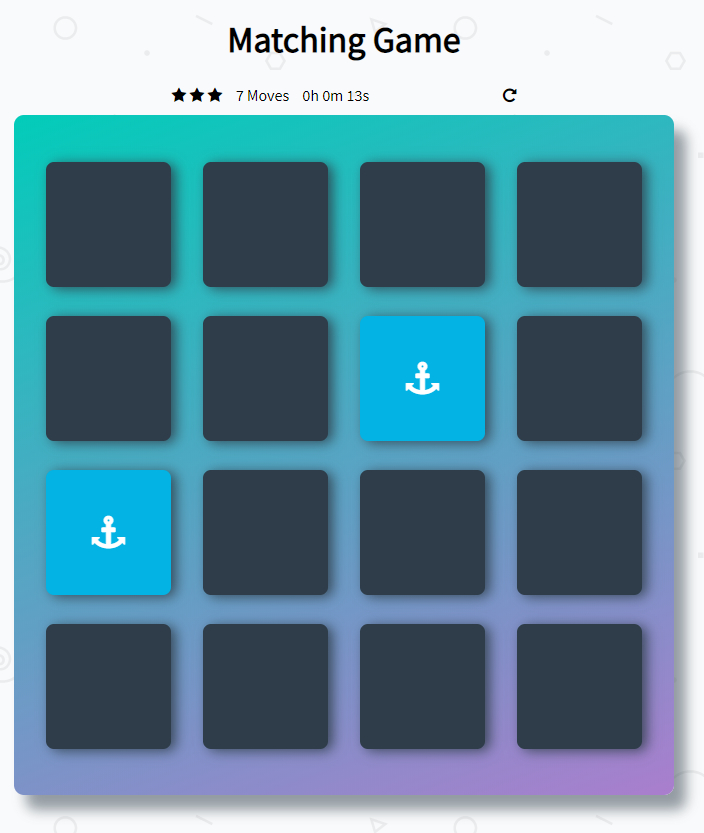

# Matching Game

A JavaScript matching game. Match together all cards to win!

## Getting Started

Open index.html in your browser of choice.

## Dependencies

- app.css
- app.js
- Icons: Font Awesome

## How To Play

Pick one card and pick another to create a pair. If they match, the cards are saved. If they don't match, the cards are flipped back to their original positions. Continue picking cards until all 16 cards are matched.

Take note of how many cards you flip. The less turns you take, the better your score. A timer also tracks your game duration.